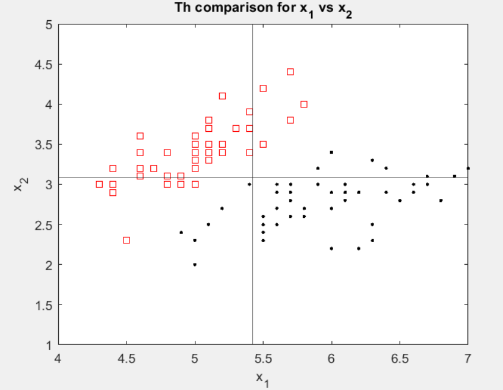
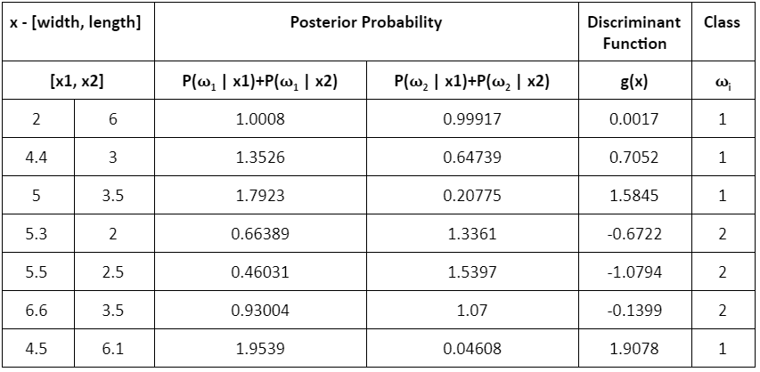

# Bayesian Classification Method (Univariate & Multivariate Gaussian)
> The program applies univariate Gaussian class condition probability density to design a 2-class minimum-error classifier (dichotomizer) to classify IRIS samples into Iris Setosa or Iris Versicolour with respect to featyre Sepal Width. The program returns the posterior probabilites and classifies a the values x1 = [3.3,4.4,5.0,5.7,6.3]. A separate program runs preprocesses the same IRIS data but applies multivariate Gaussian to classify the following vectors: [2 6],[4.4 3],[5 3.5],[5.3 2],[5.5 2.5],[6.6 3.5],[4.5 6.1].

## Table of contents
* [General info](#general-info)
* [Technologies](#technologies)
* [Classified Data](#classified-data)
* [Status](#status)
* [Contact](#contact)

## General info
The purpose of this project is to explore the Bayesian Decision Theory (a fundamental statistical approach to the problem of classification). 

## Technologies
* MATLAB- version R2020a

## Classified Data

> Univariate Gaussian Decision Boundary Plot

> Multivariate Gaussian Classification Table

## Status
Project is: _finished_

## Contact
> Created by [@akansha-n888](https://www.linkedin.com/in/akansha-nagar/) and @tsnagata
